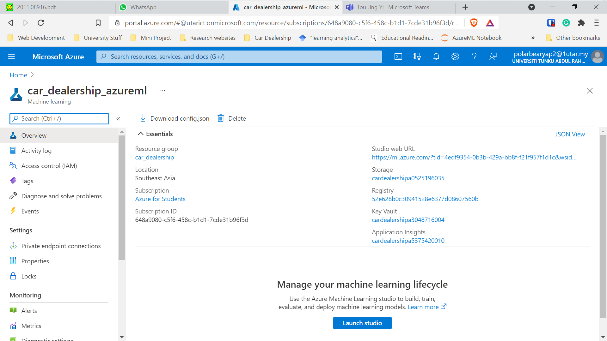
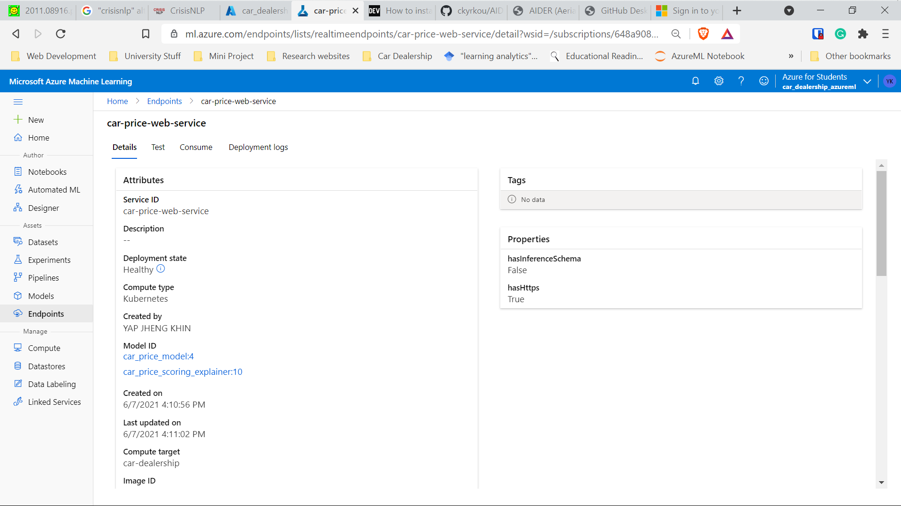

# car-dealership-automl

## Table of Contents
* [Learning Purpose](#Learning-Purpose-)
* [Snapshot](#Snapshot)
* [Summary](#Summary)
* [Learning Lessons](#Learning-Lessons)
* [Credits](#Credits)

## Learning Purpose &#128218;
1. To learn how to implement explainable AI in deployment.
2. To learn ways to deploy machine learning models using AutoML APIs like Azure Machine Learning.
3. To get my hands dirty in DevOps &#128521;.

## Snapshot

1. Machine Learning Workspace

- 

2. Model and the model explainer deployed to AKS cluster.
- 

> As mentionend [here](#Learning-Lessons), I deleted the machine learning workspace earlier on because it's too expensive to put idle. Thus, GIF is not available &#128531;.

## Summary

1. The local_deployment_flask.ipynb file includes source codes for:
  - Preparing the AI explainer model to be used in this [project](https://github.com/polarBearYap/car-dealership-flask-api). More information regarding the explainer can be found in this [MS Docs](https://docs.microsoft.com/en-gb/azure/machine-learning/how-to-machine-learning-interpretability).
  - Deploying to local compute instance.
  - Deploying to Azure Kubernetes Service (AKS).
  - Refer to this [notebook](https://polarbearyap.github.io/car-dealership-automl/) to learn more.

## Technology Applied &#129302;
- [Azure AutoML](https://docs.microsoft.com/en-us/azure/machine-learning/concept-automated-ml): Auto optmization of machine learning models without even trying &#129315;.

## Software Requirement (Windows 10 Environment) &#128187;
- Jupyter Notebook
- Azure free account (Poor man choice &#129299;)

## Learning Lessons

- I learn how the Azure cost is calculated, next time I should better delete all the machine learning resources ASAP. Or else the storage fee going to pile up &#128184;! 

## Credits

1. Stack Overflow Community
2. My university UTAR. For renewing my free $100 Azure credit yearly. However, I almost used finish already due to inexperience &#128546;.

Python dependencies can be found in the requirements.txt.
